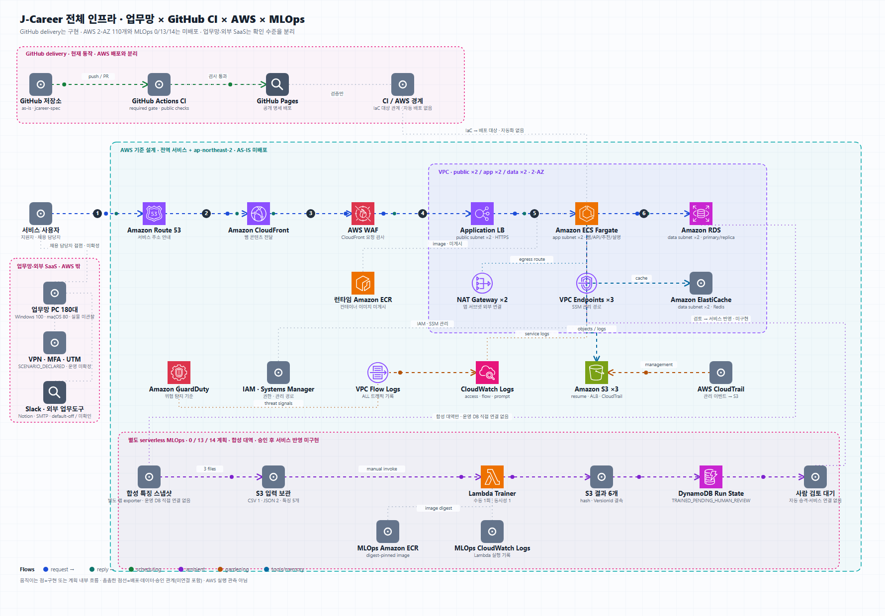

# J-Career 서비스·AWS 아키텍처

J-Career는 구직자와 기업을 연결하는 채용 플랫폼입니다. 이 저장소는 공고 추천, 기업용 인재
탐색, 지원 관리와 AI 설명을 뒷받침하는 AWS 기준 설계와 MLOps 모델 검증 체계를 함께 제공합니다.
서비스 구조부터 데이터, 보안·관측, 검증 환경과 외부 업무 시스템 경계까지 같은 기준으로 살펴볼 수 있습니다.

## 바로 보기

- [서비스 아키텍처](https://kshield-junior-17th-proj.github.io/jcareer-spec/)
- [업무망·GitHub CI·AWS·MLOps 전체 인프라 지도](https://kshield-junior-17th-proj.github.io/jcareer-spec/terraform/asis/architecture.html)
- [MLOps 7단계 모델 검증](https://kshield-junior-17th-proj.github.io/jcareer-spec/mlops/)
- [AWS 검증 환경](https://kshield-junior-17th-proj.github.io/jcareer-spec/terraform/lab/)



움직이는 점은 설계상 데이터 이동 순서를 설명합니다. AWS에서 관측한 요청이나 배포 상태를
뜻하지 않습니다. [움직이는 SVG 원본](assets/JCAREER_FULL_INFRA_ANIMATED.svg)과
[편집 가능한 전체 지도](terraform/asis/JCAREER_FULL_INFRA.drawio)를 별도 링크에서 열 수 있습니다.

## 구성 한눈에 보기

| 구성 | 역할 | 현재 관리 기준 |
|---|---|---|
| [`terraform/asis`](terraform/asis/README.md) | J-Career 서비스·AWS 기준 설계 | 서울 리전 2-AZ, 6개 모듈, Terraform 계획 항목 110개 |
| [`terraform/serverless-mlops`](terraform/serverless-mlops/README.md) | 합성 데이터 기반 후보 모델 검증 | bootstrap 13개 적용 확인, runtime 14번째 Lambda 미배포·미실행 |
| [`terraform/serverless-opendart`](terraform/serverless-opendart/README.md) | 기업 공개정보 온디맨드 갱신 | 기본 잠금 0개, bootstrap 8개, runtime 11개 source·미배포 |
| [`terraform/lab`](terraform/lab/README.md) | 서비스와 데이터 흐름을 확인하는 AWS 검증 환경 | 모드별 13/14/23/24개, 외부 인바운드 0개, SSM 관리 접속 |

## 기술 상태와 검증 범위

기준 설계의 110개는 AWS에 접속하지 않는 Terraform 계획에서 계산한 생성 예정 항목이며 미배포입니다.
MLOps, OpenDART와 AWS 검증 Lab은 기준 설계와 분리된 Terraform 루트입니다. 2026-08-31에는
MLOps bootstrap 기반 13개와 serverless roots용 비공개 state S3 1개 생성이 확인됐지만,
애플리케이션 이미지 게시·Lambda 실행·추천 서비스 연결은 확인되지 않았습니다.
Slack·Notion·SMTP 외부 업무도구 어댑터는 기본 비활성 로컬 소스이며 실제 외부 계정 연결과
메시지 전송은 미확인입니다. TRACE·JC-RECEIPT는 실행 인프라 구성요소가 아니므로 전체 지도에서
제외하고 보조 검토 설명으로만 다룹니다.

## MLOps 명세 바로 보기

- **브라우저용:** [MLOps 모델 검증 체계](https://kshield-junior-17th-proj.github.io/jcareer-spec/mlops/)
- [PDF 명세](mlops/JCAREER_MLOPS_SYSTEM_SPEC.pdf)
- [한글 PNG 흐름도](terraform/serverless-mlops/JCAREER_MLOPS_FLOW.drawio.png)
- [편집 가능한 draw.io 원본](terraform/serverless-mlops/JCAREER_MLOPS_FLOW.drawio)
- [학습·검증 소스](src/mlops/README.md)
- [서버리스 Terraform](terraform/serverless-mlops/README.md)

MLOps는 기존 110개 기준 설계와 별도입니다. 기본 `disabled`는 0개, `bootstrap`은 13개,
이미지 해시를 고정한 Lambda까지 포함한 `runtime`은 14개입니다. 2026-08-31 현재 bootstrap
13개는 검토한 saved plan 그대로 적용됐고, runtime의 14번째 Lambda와 이미지 게시·실행은 아직 없습니다.

현재 배치 경로는 합성 DB 옆 내보내기 도구가 만든 비교 수치 CSV 1개와 검증용 JSON 2개를
feature-only 입력으로 S3에서 읽습니다. Lambda는 후보 모델을 한 차례 학습한 뒤 S3 결과 파일 6개,
DynamoDB 실행 상태와 CloudWatch Logs를 기록하고 `TRAINED_PENDING_HUMAN_REVIEW`에서 멈춥니다.
자동 일정, 공개 API, SageMaker, 자동 승격과 기존 추천 점수 연결은 현재 범위에서 분리했습니다.
두 가지 문서 비교값은 단어 중복 정도만 나타내며, 합격 가능성이나 인재 수준 판단에는 사용하지 않습니다.

확인 문자열은 의도하지 않은 활성화를 막는 절차 장치일 뿐, 사용자 인증이나 조직의 평가 승인을
증명하지 않습니다. 합성 여부 검사도 기업 원문의 출처까지 증명하지 못합니다.

## AS-IS 명세 바로 보기

- **브라우저용:** [전체 명세](https://kshield-junior-17th-proj.github.io/jcareer-spec/terraform/asis/) · [대화형 아키텍처](https://kshield-junior-17th-proj.github.io/jcareer-spec/terraform/asis/architecture.html)
- [웹 명세](terraform/asis/index.html): 서비스, 기능, API, 데이터·이벤트 흐름, 보안·운영·장애 시나리오
- [대화형 아키텍처](terraform/asis/architecture.html): 전체 시스템 지도, 경로별 강조와 MLOps 7단계 도면 전환
- [PDF 명세](terraform/asis/JCAREER_ASIS_SYSTEM_SPEC.pdf)
- [전체 인프라 애니메이션 SVG](assets/JCAREER_FULL_INFRA_ANIMATED.svg)
- [기업 목표·USD 50 핵심 평가 슬라이스 SVG](assets/JCAREER_PRODUCTION_ASSESSMENT_MAP.svg): 서비스 실행면, 별도 Evidence Desk, OpenDART·MLOps, 미배포 목표 구조를 상태별로 구분
- [핵심 평가 슬라이스 해설](assets/JCAREER_PRODUCTION_ASSESSMENT_MAP.md)
- [전체 인프라 draw.io 원본](terraform/asis/JCAREER_FULL_INFRA.drawio)
- [PNG 도면](terraform/asis/JCAREER_ASIS_FLOW.drawio.png)
- [쉽게 보는 draw.io 원본](terraform/asis/JCAREER_ASIS_FLOW.drawio)
- [보조 상세 draw.io 원본](terraform/asis/JCAREER_ASIS_2AZ.drawio): 원본 작업 트리의 별도 기술 기록이며 공개 기준 도면 수량에는 포함하지 않음

업무망 PC 180대는 Windows 100대와 macOS 80대로 구분합니다. 이 수량은 사용자 확정 입력이며
Terraform 자원 수나 동시 사용자 수로 바꾸어 해석하지 않습니다. 실물 배치는 관찰하지 않았고,
Windows 3대와 macOS 3대 검토 표본도 아직 실행하지 않았습니다.

Slack은 AWS 리소스가 아닌 외부 업무 SaaS·자산대장 경계입니다. Windows/macOS 이미지 소스의
`app.slack.com` 바로가기와 macOS 종료 시 best-effort Slack 프로세스 종료에 더해, API 컨테이너의
기본 비활성 Incoming Webhook 어댑터 소스와 무통신 회귀시험을 확인했습니다. 실제 workspace
사용·계정·보존 정책과 webhook 전송은 `SCENARIO_USE_UNVERIFIED`입니다. Notion API와 SMTP/TLS
메일 어댑터도 소스만 구현됐으며 실제 workspace·메일 시스템 연결이나 AWS 리소스는 없습니다.

## 보안 서비스는 어디에 있나

| 서비스 | AS-IS 선언 위치 | 설계 모델에서 확인되는 내용 | 배포 검증 상태 |
|---|---|---|---|
| AWS WAF | [`edge/main.tf`](terraform/asis/edge/main.tf) | CloudFront 범위, Common·SQLi 관리형 규칙, 지표·샘플 요청 | 별도 검증 기록 필요 |
| GuardDuty | [`observability/main.tf`](terraform/asis/observability/main.tf) | detector 활성 선언 | 별도 검증 기록 필요 |
| CloudTrail | [`observability/main.tf`](terraform/asis/observability/main.tf) | 관리 이벤트를 S3로 기록하도록 선언 | 별도 검증 기록 필요 |
| VPC Flow Logs | [`observability/main.tf`](terraform/asis/observability/main.tf) | VPC의 ALL 트래픽을 CloudWatch Logs로 전달하도록 선언 | 별도 검증 기록 필요 |
| CloudWatch Logs | [`observability/main.tf`](terraform/asis/observability/main.tf) | access 365일, flow 30일, prompt_raw 보존기간 미설정 | 별도 검증 기록 필요 |

WAF 요청 로그, GuardDuty 알림·자동 대응, CloudTrail 데이터 이벤트·CloudWatch 연동,
CloudWatch 경보·대시보드 등은 이 AS-IS 모델에 선언되어 있지 않습니다. 자세한 설정과 한계는
[`terraform/README.md`](terraform/README.md)에 정리했습니다.

AS-IS 파일은 자격증명 없이 다음처럼 검토합니다. `apply`는 실행하지 마십시오.

```powershell
terraform -chdir=terraform/asis init -backend=false -lockfile=readonly
terraform -chdir=terraform/asis validate
terraform -chdir=terraform/asis plan -refresh=false -lock=false
```

저장된 plan, state, `tfvars`, 계정 정보는 저장소에 올리지 않습니다. 포함된 검증 JSON은 원본
작업 트리에서 만든 기록입니다. 공개 사본의 독립 실행 결과로 오해하면 안 됩니다.
AS-IS 코드의 12자리 숫자는 가상 입력값과 AWS가 공개한 서비스 주체 값뿐이며, 조직 계정
식별자는 포함하지 않습니다.

## 현재 확인된 AWS 상태

2026-08-31 비식별 관찰 기록을 기준으로 서로 다른 세 범위를 분리합니다.

| 범위 | 확인된 상태 | 아직 확인되지 않은 것 |
|---|---|---|
| 기준 `terraform/asis` | 2-AZ·6모듈·110개 Terraform 모델 | apply, ECS 이미지 게시, 서비스 실행 |
| Bedrock | 서울 리전 APAC Nova Lite 직접 합성 호출 1건 PASS(입력 39·출력 53토큰) | API → LLM Gateway → capability broker → Bedrock 전체 경로 |
| MLOps | 비공개 state S3 1개와 bootstrap 13개 기반 자원 적용 | ECR 이미지 게시, Lambda 배포·실행, 결과 6종, 사람 검토·서비스 연결 |
| OpenDART | 0/8/11 source와 승인 경계 | Terraform 적용, API key 준비, 외부 live 조회 |
| AWS 검증 Lab | LabOnly 7개 신호 0 | 새 plan/apply, 원격 6서비스와 Bedrock end-to-end |

MLOps 기반 13개는 GitHub Actions가 자동 배포한 것이 아닙니다. 실제 식별자·자격증명·state 내용은
이 저장소와 공개 페이지에 기록하지 않습니다.

## AWS 검증 환경 배포

다음은 2026-08-30의 역사적 Lab 시도 기록입니다. 새 검증 계정에서 HTTPS와 Bedrock을 포함한 24개 생성 계획은 통과했습니다.
적용은 IAM 역할 생성 권한 부족으로 중단됐고, 부분 생성된 16개 항목은 검토된 삭제 계획으로
정리했습니다. 이후 2026-08-31 LabOnly 재확인에서도 Lab 전용 신호는 0개였습니다. Bedrock 직접 합성 호출은 통과했지만 원격
애플리케이션 전체 경로는 아직 다시 확인하지 못했습니다. 자세한 범위는
[최근 배포 관찰 기록](terraform/lab/DEPLOYMENT_OBSERVATION_2026-08-30.md)에 있습니다.
재시도에 필요한 최소 작업과 제한 조건은
[`IAM 재시도 체크리스트`](terraform/lab/IAM_RETRY_PREREQUISITES_2026-08-30.md)에
정리했습니다.

필요 도구는 AWS CLI, Terraform `1.15.9`, Python 3입니다. 한 실행기가 plan 검사, AWS 생성,
SSM 전송, 컨테이너 빌드와 원격 기능 시험을 이어서 처리합니다. 다만 plan과 apply는 일부러
두 단계로 나눴습니다. 먼저 plan에서 출력된 세 해시를 확인한 뒤, 같은 기능 설정과 같은 임시
접속 토큰으로 apply해야 합니다.

다음 예시는 CloudFront HTTPS 진입점과 Bedrock 호출 경로까지 여는 구성입니다. 임시 토큰은
화면에 표시하거나 파일에 저장하지 말고 `SecureString`으로 입력합니다.

```powershell
$previewBootstrap = Read-Host '64자리 임시 접속 토큰' -AsSecureString

# 1. plan 작성과 안전 검사 — AWS 자원은 바뀌지 않음
.\terraform\lab\provisioning\deploy-lab.ps1 `
  -ActivationAcknowledgement JCAREER_SYNTHETIC_LAB_APPROVED `
  -EnableAwsHttpsPreview `
  -HttpsPreviewAcknowledgement JCAREER_SYNTHETIC_HTTPS_PREVIEW_APPROVED `
  -HttpsPreviewBootstrapToken $previewBootstrap `
  -EnableBedrockLive `
  -BedrockAcknowledgement JCAREER_SYNTHETIC_BEDROCK_APPROVED

# 2. 위 plan에서 출력된 세 해시와 같은 SecureString을 사용
.\terraform\lab\provisioning\deploy-lab.ps1 `
  -ActivationAcknowledgement JCAREER_SYNTHETIC_LAB_APPROVED `
  -EnableAwsHttpsPreview `
  -HttpsPreviewAcknowledgement JCAREER_SYNTHETIC_HTTPS_PREVIEW_APPROVED `
  -HttpsPreviewBootstrapToken $previewBootstrap `
  -EnableBedrockLive `
  -BedrockAcknowledgement JCAREER_SYNTHETIC_BEDROCK_APPROVED `
  -ProviderAccountSha256 <plan에서 출력된 계정 해시> `
  -ReviewedSavedPlanSha256 <plan 파일 해시> `
  -ReviewedPlanSemanticSha256 <plan 내용 해시> `
  -Apply -OpenPreview
```

실행기는 삭제·교체, SSH, 전체 인터넷에 열린 인바운드, 허용 목록 밖의 자원이 plan에 있으면
중단합니다. apply 단계에서는 새 plan을 만들지 않고 앞에서 검사한 saved plan만 사용합니다.

## 생성 범위

- 리전: 서울 `ap-northeast-2`
- 실행 서버: `t3.small` 1대와 암호화된 `gp3` 20GiB
- HTTPS 경로: CloudFront → VPC origin → private EC2의 3000번 포트
- 인바운드: CloudFront 관리 주소 범위만 허용, SSH와 `0.0.0.0/0` 규칙 없음
- 런타임: PostgreSQL, Redis, API, 매칭기, 설명 게이트웨이, 웹의 핵심 6개 서비스
- 데이터: 예약된 합성 회원·기업·지원 데이터만 사용
- AI 설명: 별도 승인을 켠 경우 Bedrock broker를 거쳐 지정 모델만 호출
- 비용 제어: 240분 뒤 EC2 자동 중지와 월 USD 20 관찰 예산

자동 중지는 EC2만 멈추며 NAT Gateway와 CloudFront를 삭제하지 않습니다. 예산도 하드캡이
아니므로 시연 뒤에는 아래 정리 실행기를 사용해야 합니다. OpenDART는 별도 서버리스 상태,
이미지 검사·게시, SecureString API 키가 모두 준비된 뒤에만 이 환경에 연결됩니다.

## 정리

먼저 삭제 전용 plan을 만들고, 출력된 세 해시를 같은 방식으로 다시 넣습니다.

```powershell
.\terraform\lab\provisioning\destroy-lab.ps1 `
  -DestroyAcknowledgement JCAREER_SYNTHETIC_LAB_DESTROY_APPROVED

.\terraform\lab\provisioning\destroy-lab.ps1 `
  -DestroyAcknowledgement JCAREER_SYNTHETIC_LAB_DESTROY_APPROVED `
  -ProviderAccountSha256 <plan에서 출력된 계정 해시> `
  -ReviewedSavedPlanSha256 <plan 파일 해시> `
  -ReviewedPlanSemanticSha256 <plan 내용 해시> `
  -Apply
```

state, saved plan, 승인 파일, `.env`와 실제 계정 식별자는 Git에 올리지 않습니다. 세부 동작과
SSM 전용 접속 방법은 [`terraform/lab/README.md`](terraform/lab/README.md)에 있습니다.
